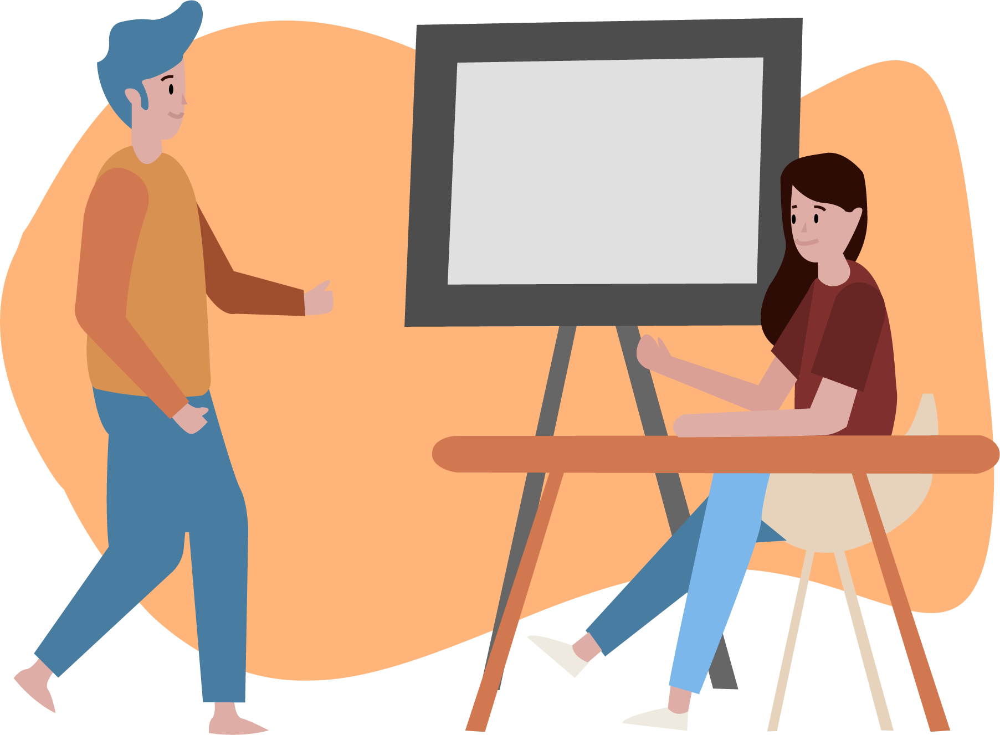

You can view the website here: https://cpentrepreneurs.com/

Looking for clubs my second-year of college, I happened upon Cal Poly Entrepreneur's website. As I browsed the site, I noticed many bugs and errors, from a disappearing menu on mobile to poor responsiveness.

So, I reached out to the board, asked for a position to improve the website, and they accepted.

I started by transitioning from wordpress to webflow. Webflow, I noticed, was both less expensive and more intuitive to use than wordpress.

Then, I began designing the layout of the website...

I also began creating graphics for the website for improved sustainability ...

Finally it was done!